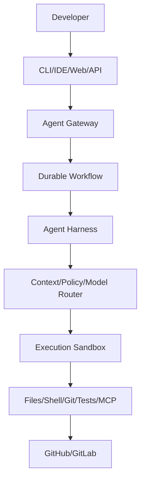

# GiX-Coder Documentation Standards

## Documentation Hierarchy

```
docs/
├── product/                 # Product-level (charter, roadmap)
├── architecture/            # Architecture (baseline, decisions, structure)
├── adr/                     # Architecture Decision Records
├── security/                # Security (threat model, baseline, incidents)
├── qa/                      # Quality (testing, gates, standards)
├── operations/              # Operations (runbooks, deployment, monitoring)
└── phases/                  # Phase-specific artifacts
    └── phase-XX/
        ├── README.md
        ├── requirements.md
        ├── architecture.md
        ├── plan.md
        ├── acceptance-criteria.md
        ├── implementation.md
        ├── verification.md
        ├── remediation.md
        └── approval.md
```

## Document Types & Standards

### 1. Product Charter (`docs/product/charter.md`)

- Vision, mission, principles
- Target users, key capabilities
- Success metrics, non-goals
- **Review**: Quarterly

### 2. Architecture Baseline (`docs/architecture/baseline.md`)

- Architectural vision diagram
- Core decisions with rationale
- Technology choices
- Domain model
- Security architecture
- Non-functional requirements
- Evolution path
- **Review**: Per major phase

### 3. ADRs (`docs/adr/NNNN-*.md`)

- Follow ADR framework exactly
- One decision per ADR
- **Review**: When decision changes

### 4. Security Docs

- Threat model (STRIDE, mitigations)
- Security baseline (controls, requirements)
- Incident response (runbooks, contacts)
- **Review**: Semi-annually + post-incident

### 5. QA Docs

- Testing strategy (this doc's domain)
- Quality gates (thresholds, tools)
- Test standards (patterns, anti-patterns)
- **Review**: Per phase

### 6. Operations Docs

- Runbooks (per service, per scenario)
- Deployment guide (environments, procedures)
- Monitoring guide (dashboards, alerts, SLOs)
- Disaster recovery (RPO/RTO, procedures)
- **Review**: Quarterly + post-incident

### 7. Phase Artifacts (`docs/phases/phase-XX/`)

Each phase requires:

| File                     | Purpose                     | Author     | Reviewer     |
| ------------------------ | --------------------------- | ---------- | ------------ |
| `README.md`              | Phase summary, status       | Planner    | Architect    |
| `requirements.md`        | Functional + non-functional | Planner    | Product      |
| `architecture.md`        | Phase architecture, changes | Architect  | Architect    |
| `plan.md`                | Implementation plan, tasks  | Planner    | Architect    |
| `acceptance-criteria.md` | Measurable success criteria | Planner    | Product      |
| `implementation.md`      | Implementation summary      | Builder    | Reviewer     |
| `verification.md`        | Verification results        | Verifier   | Architect    |
| `remediation.md`         | Issues found + fixes        | Remediator | Verifier     |
| `approval.md`            | Human sign-off              | Release    | Stakeholders |

## Writing Standards

### Language

- **English** (US spelling)
- **Present tense** for current state
- **Future tense** for planned state
- **Past tense** for completed work
- Active voice preferred
- Concise, precise, unambiguous

### Formatting

- **Markdown** (CommonMark + GitHub extensions)
- **Headers**: ATX style (`#`, `##`, `###`)
- **Code blocks**: Fenced with language hint
- **Lists**: Dash for unordered, numbers for ordered
- **Tables**: GitHub-flavored markdown tables
- **Links**: Relative for internal, absolute for external
- **Images**: `./images/` relative to doc

### Structure

```markdown
# Title (H1 - one per document)

## Overview (H2)

Brief summary (2-3 sentences)

## Section (H2)

Content...

### Subsection (H3)

Details...

#### Detail (H4)

Granular details...
```

### Required Sections

Every document must have:

1. **Title** (H1)
2. **Overview** (purpose, audience, scope)
3. **Content** (structured by domain)
4. **References** (links to related docs, ADRs, issues)
5. **Metadata** (author, date, reviewers, status)

### Metadata Block (End of Document)

```markdown
---
title: Document Title
type: architecture|adr|security|qa|operations|phase
phase: 00|01|02|...
status: draft|review|approved|deprecated
author: Name
date: YYYY-MM-DD
reviewers: Name, Name
approved_by: Name
related_adrs: [ADR-0001, ADR-0002]
related_issues: [#123, #456]
---
```

## Code Documentation

### Go

```go
// Package gateway implements the Agent Gateway service.
// It handles API requests, authentication, routing, and rate limiting.
package gateway

// Gateway is the main entry point for the Agent Gateway.
// It coordinates request handling, authentication, and routing.
type Gateway struct {
    // config holds the gateway configuration.
    config *Config

    // router routes requests to appropriate handlers.
    router *Router
}

// NewGateway creates a new Gateway with the given configuration.
// Returns an error if configuration is invalid.
func NewGateway(cfg *Config) (*Gateway, error) {
    // ...
}
```

- Package comment for every package
- Exported types/functions documented
- Comments explain _why_, not _what_
- No commented-out code

### TypeScript

```typescript
/**
 * GatewayService handles API requests, authentication, and routing.
 * It is the main entry point for the Agent Gateway.
 */
export class GatewayService {
  /**
   * Creates a new GatewayService.
   * @param config - Gateway configuration
   * @throws {ConfigurationError} If configuration is invalid
   */
  constructor(private readonly config: GatewayConfig) {}
}
```

- JSDoc for all exported symbols
- `@param`, `@returns`, `@throws` for functions
- `@example` for complex usage

### API (Protobuf/OpenAPI)

```protobuf
// GatewayService provides the Agent Gateway API.
// It handles request routing, authentication, and rate limiting.
service GatewayService {
  // ExecuteWorkflow starts a new workflow execution.
  // Returns the execution ID for tracking.
  rpc ExecuteWorkflow(ExecuteWorkflowRequest) returns (ExecuteWorkflowResponse);
}
```

- Service and method comments
- Field comments for non-obvious fields
- Example values where helpful

## Diagrams

### Mermaid (Preferred)



### PlantUML (For Complex)

- Sequence diagrams
- Component diagrams
- Deployment diagrams

### Standards

- Source in `docs/architecture/diagrams/`
- Rendered in CI to SVG/PNG
- Committed as source + rendered
- Alt text for accessibility

## Versioning & Changelog

### Document Versioning

- Documents versioned with code (Git)
- Major changes → new ADR
- Minor changes → PR with description
- No separate version numbers

### Changelog

- `CHANGELOG.md` at root
- Per release (semantic versioning)
- Categories: Added, Changed, Deprecated, Removed, Fixed, Security
- Links to PRs/ADRs

## Review Process

### Documentation PRs

- Same process as code PRs
- Reviewed by domain owner
- Architect for architecture docs
- Security for security docs
- Product for product docs

### Review Criteria

- [ ] Follows standards
- [ ] Accurate and current
- [ ] Clear structure and language
- [ ] Proper cross-references
- [ ] Metadata complete
- [ ] Diagrams render correctly

## Tooling

### Validation (CI)

- Markdown lint (`markdownlint`)
- Link check (`markdown-link-check`)
- Spell check (`cspell`)
- Mermaid render check
- Metadata schema validation

### Generation

- ADR index auto-generated
- API docs from proto/OpenAPI
- Changelog from conventional commits

## Anti-Patterns

| Anti-Pattern                | Why                               |
| --------------------------- | --------------------------------- |
| Outdated documentation      | Misleads, causes errors           |
| Documentation in code only  | Not discoverable, no structure    |
| No cross-references         | Fragmented knowledge              |
| Wall of text                | Unreadable, unmaintainable        |
| Missing metadata            | No ownership, no audit trail      |
| Duplicate content           | Inconsistency, maintenance burden |
| Generated docs not reviewed | Errors propagate                  |

---

## References

- [Engineering Principles](engineering-principles.md)
- [Architecture Baseline](baseline.md)
- [ADR Framework](../adr/framework.md)
- ADR-0002: Modular Monolith

---

## Metadata

---

title: GiX-Coder Documentation Standards
type: architecture
phase: 00
status: Verified
author: Architect
date: 2024-10-07
reviewers: Architect, Platform Lead
approved_by: Architect (Principal Architect)
related_adrs: [ADR-0002]
related_issues: []
---
